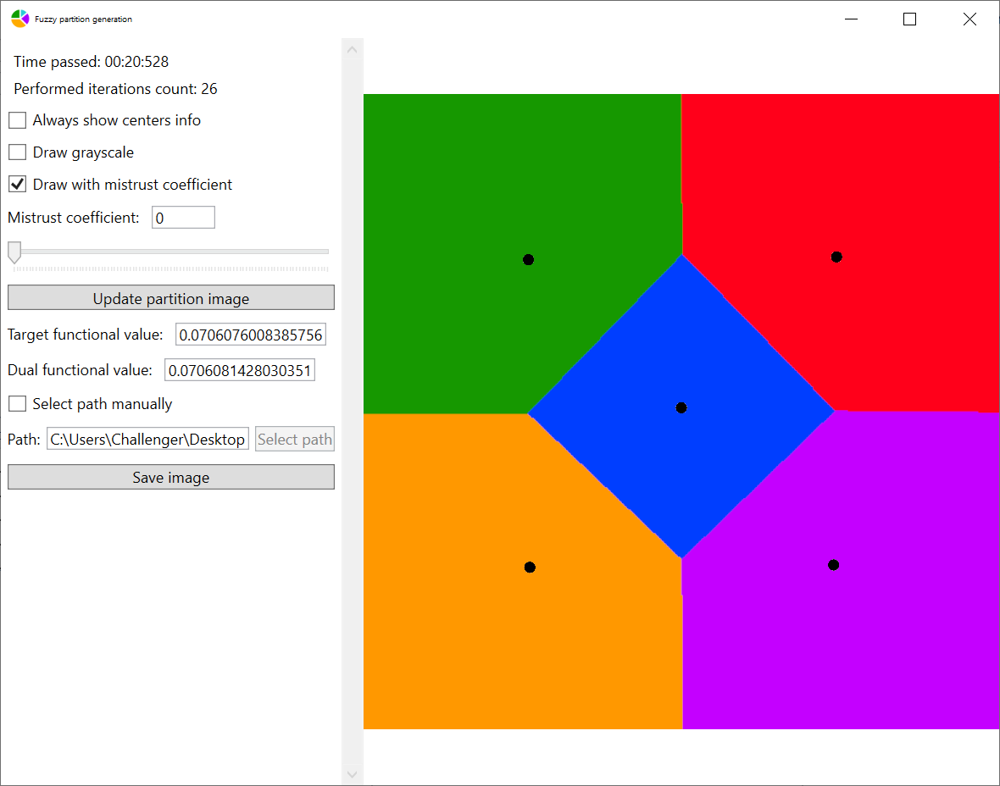

# Optimal fuzzy partition

This repo is the program part of my masters diploma. Full theme sounds like "Creation of fuzzy Voronoi diagrams with optimal generator points placing by applying the optimal partition theory".

## Table Of Contents

- [Application using](#Application-using)
- [Used math](#Used-math)
- [Used technologies](#Used-technologies)
- [Project structure](#Project-structure)
- [How to build](#How-to-build)
  - [Auto build](#Auto-build:)
  - [Manual build](#Manual-build)
- [Supported languages](#Supported-languages)
- [Used packages](#Used-packages)

## Scope of application

This program is appliable in situations when you have a space where consumers of some resource are distributed, and a finite set of some suppliers that you need to place in optimal way. Optimal way is such placing that sum of all distances from consumers to their suppliers will be minimal.

Typical examples of resource suppliers are:

- stores
- cell stations
- power stations
- schools/parks/gas stations etc.

Typical example of resource consumer are people. In this case power of resource consuming in a particular point of space is a population density.

## Application using

In the first window you change settings of partition:

In the second window you can see the result of the partition creation process:

From the second window you can explore the partition info, such as centers positions, gradient direction, partition quality estimation etc:

Partition view features:

- interactive exploring partition result
- draw partition in grayscale
- change the mistrust coefficient of the shown partition without re-creating it.
- save partition image

## Used math

- Fuzzy logic
- Optimal partition theory
- Calculus (integrals and derivatives)

## Used technologies

- WPF
- Unity Engine
- Compute shaders (HLSL)
- Win32

## Project structure

There are a .NET solution and Unity project. .NET Solution contains algorithms base, tests and WPF app. Unity project is used for creating and showing partition images. WPF app is used for settings.

The Unity player is built into the WPF window, so we can set up, create and view partitions in one app.

## How to build

In order to build program, you need:

- Visual Studio
- .NET Framework 4.8
- .NET 5
- Unity Engine

### Auto build

To run the automatic release build process, execute the Powershell script "BuildRelease.ps1" in the root of the repo.

### Manual build

Since the project consists of two executables - unity player for calculations and WPF app for managing - we build it in several steps.

1. Build the "OptimalFuzzyPartitionAlgorithm" in "OptimalFuzzyPartition" solution (you can just build all solution).
2. Build Unity player. It can be done from Unity Editor via "Build->Build to debug/release folder" menu. The executable will be built to the build folder of the WPF app, so we won't have to copy it manually.
3. Build and run project "OptimalFuzzyPartition" in "OptimalFuzzyPartition" solution. You can just run it if it's already built.

## Supported platforms

Since WPF only supports Windows, whole program is tied to Windows. But in the case of need, the View part can be ported to [Avalonia](https://avaloniaui.net/) framework, which is crossplatform, without changing the ViewModel.

Also, since Unity is crossplatform, you can run program from Unity on other platforms, such as Linux or MacOS, without any changes. In this case you will use Unity UI, which is less convenient.

## Supported languages

At the current moment GUI supports next languages:

- English
- Russian
- Ukrainian

## Used packages

- [MathNet.Numerics](https://numerics.mathdotnet.com/)
- [NLog](https://nlog-project.org/)
- [SimpleTCP](https://github.com/BrandonPotter/SimpleTCP)
- [NaughtyAttributes](https://assetstore.unity.com/packages/tools/utilities/naughtyattributes-129996)
- [NuGet for Unity](https://github.com/GlitchEnzo/NuGetForUnity)
- [IngameDebugConsole](https://assetstore.unity.com/packages/tools/gui/in-game-debug-console-68068)

## License

This project is available under the MIT license.
