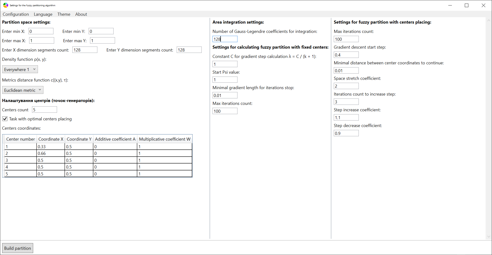

# Optimal fuzzy partition

This repo is the program part of my bachelor diploma. Full theme sounds like "Creating of fuzzy Voronoi diagrams with optimal generator points placing by applying the optimal partition theory".

## Table Of Contents

* [Application using](#Application-using)
* [Used math](#Used-math)
* [Used technologies](#Used-technologies)
* [Project structure](#Project-structure)
* [How to build](#How-to-build)
    * [Auto build](#Auto-build:)
    * [Manual build](#Manual-build)
* [Supported languages](#Supported-languages)
* [Used packages](#Used-packages)

## Application using

In the first window you change settings of partition:

In the second window you can see the result of partition creation process:

From the second window you can:
 * change the mistrust coefficient of the shown partition without re-creating it.
 * save partition images.

## Used math

* Fuzzy logic
* Optimal partition theory
* Calculus (integrals and derivatives)

## Used technologies

* WPF
* Unity Engine
* Compute shaders (HLSL)
* Win32

## Project structure

There are a .NET solution and Unity project. .NET Solution contains algorithms base, tests and WPF app. Unity project is used for creating and showing partition images. WPF app is used for settings.

The Unity player is built into the WPF window, so we can set up, create and view partitions in one app.

## How to build

### Auto build:

To run the automatic release build process, execute the Powershell script "BuildRelease.ps1" in the root of the repo.

### Manual build:

Since the project consists of two executables - unity player for calculations and WPF app for managing - we build it in several steps.

1. Build the "OptimalFuzzyPartitionAlgorithm" in "OptimalFuzzyPartition" solution  (you can just build all solution).
2. Build Unity player. It can be done from Unity Editor via "Build->Build to debug/release folder" menu. The executable will be built to the build folder of the WPF app, so we won't have to copy it manually.
3.  Build and run project "OptimalFuzzyPartition" in "OptimalFuzzyPartition" solution. You can just run it if it's already built.

## Supported languages

At the current moment next UI languages are supported:

* Ukrainian

## Used packages

* [MathNet.Numerics](https://numerics.mathdotnet.com/)
* [NLog](https://nlog-project.org/)
* [SimpleTCP](https://github.com/BrandonPotter/SimpleTCP)